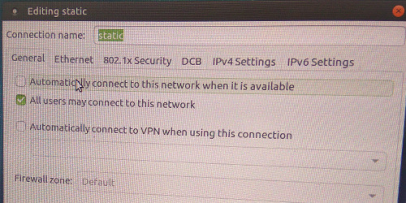

Network and Services
====================
Network configuration via Network Manager
-----------------------------------------
MSS comes with 2 predefined network configurations: Static and Dynamic.

If there is no other DHCP server in the network select Static connection
from the NetworkManager in mssadmin account. If there is existing DHCP
server then selecting Dynamic setup will cause MSS to run in proxy-DHCP
mode, IPs will be assigned by external DHCP. Edit the setup which will
not be used to disable ‘auto connect’. No other configuration changes
are required.

.. figure:: images/image00.jpg
   :alt: 

Epoptes
-------
Only user belonging to “epoptes” group can launch epoptes application,
see User Management for how to add user to a group. Using epoptes is
self evident and intuitive, however complete documentation is available
here:
`*https://translate.google.com/translate?u=http://ts.sch.gr/wiki/Linux/epoptes* <https://translate.google.com/translate?u=http://ts.sch.gr/wiki/Linux/epoptes>`__

When launching from Fatclient it has to be launched as below:

::

    ltsp-remoteapps epoptes

Web Server
----------
The My sCool Server comes pre-configured with a ready to use web server
to help you host your content and make it available on the local
network.

Hosted content can be accessed from all clients via any web browser at
`*http://server/* <http://server/>`__

Each user can host their independent content at
/home/<username>/public\_html and it may be accessed by all at
`*http://server/~<username>* <http://server/~username>`__

