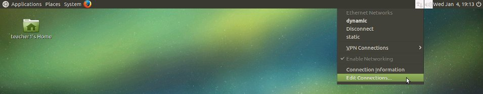
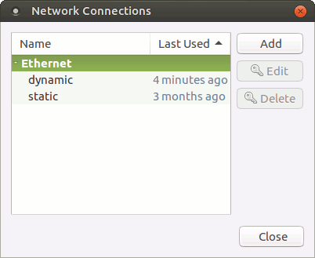
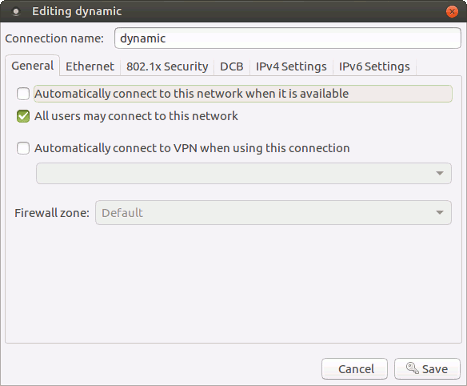
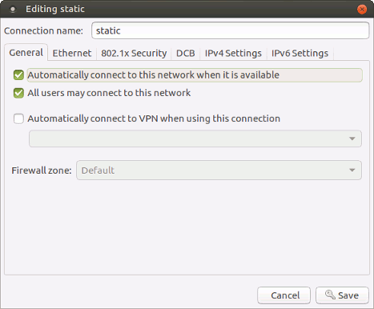

Network Configuration
====================
Via Network Manager
-----------------------------------------
MSS comes with 2 predefined network configurations: Static and Dynamic.

If your network already has a DHCP server serving IP address to devices connected on your LAN then you need to configure the MSS in Dynamic mode. If no such DHCP server exists, then configure the MSS in Static mode.

It is safe to assume that in majority of cases where a new network has just been setup for the purpose of installing the MSS, there is no pre-existing DHCP server, hence one may safely opt for Static mode.

Herein are the details of how to configure in Static or Dynamic mode: 

After login, edit the connection that would not be used and uncheck “Automatically connect to this network when it is available” to disable auto-connection attempts in the undesired mode. For example, herein below, we are *disabling ‘Dynamic’ and enabling ‘Static’ mode*.

**Network Manager - Edit Connections**

**Network Connections**

**Uncheck to switch off dynamic mode**

**Check to switch on static mode**

Finally, choose “static” in the Network Manager menu and your MSS is now operating in static mode.
