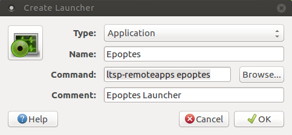

.. _monitoring-broadcasting:

Monitoring and Broadcasting
===========================

Epoptes
-------
Epoptes is a monitoring and broadcasting tool to assist teachers in imparting lessons.

Only a user belonging to “epoptes” group can launch epoptes application, see :ref:`user-management` for how to add user to a group.

All pre-configured teacher accounts are already members of the “epoptes” group. Using epoptes is self evident and intuitive, however complete documentation is available `here <https://translate.google.com/translate?u=http://ts.sch.gr/wiki/Linux/epoptes>`__.

When in Fat-client mode epoptes has to be started as below:

::

  Alt+F2 -> ltsp-remoteapps epoptes

When running in thin-client mode or when directly logged into the MSS, Epoptes can be started as below:

:: 

  Applications -> Internet -> Epoptes

How to create Epoptes Launcher ?
-------
Right click on desktop , then select "Create launcher..."

In Create Launcher Window type "Epoptes" in Name and "ltsp-remoteapps epoptes" in Command then press OK -

