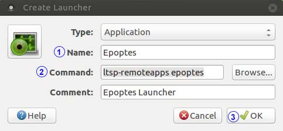

.. _monitoring-broadcasting:

Monitoring and Broadcasting
===========================

Epoptes
-------
Epoptes is a monitoring and broadcasting tool to assist teachers in imparting lessons.

Only a user belonging to “epoptes” group can launch epoptes application, see :ref:`add-user-to-epoptes-group`.

All pre-configured teacher accounts are already members of the *epoptes* group. Using epoptes is self evident and intuitive, however complete documentation is available `here <https://translate.google.com/translate?u=http://ts.sch.gr/wiki/Linux/epoptes>`__.

When using ``English-Desktop``, a teacher can start Epoptes as below:

::

  Alt+F2 -> ltsp-remoteapps epoptes

Create Epoptes Launcher
^^^^^^^^^^^^^^^^^^^^^^^
Using the steps herein a teacher may create a desktop launcher to start Epoptes with just a click.

* Right click on desktop and select ``Create launcher...``

* In ``Create Launcher`` dialog do following steps -
  
  #. Enter ``Name`` as ``Epoptes``
  #. Enter ``Command`` as ``ltsp-remoteapps epoptes``
  #. Press OK

.. note:: You may need to refresh (:kbd:`F5`) the desktop to see the newly created launcher
