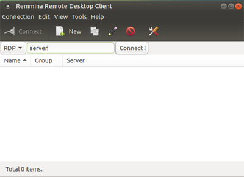
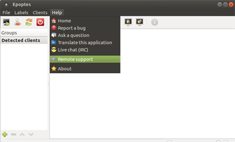
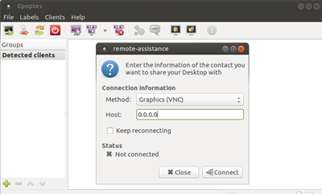

.. _remote-support:

Remote Support
===============

Login with any account

Start Remmina Remote Desktop Client from 

 Applications → Internet → Remmina

Type "server" in textbox and hit Connect
 Note : Make sure RDP is selected in dropbox.

Now, Login as mssadmin in remmina screen.

`Connect Wi-Fi/Hotspot <http://mss-update.readthedocs.io/en/latest/Connect%20Wifi.html#how-to-connect-wi-fi>`__ for Internet Connection.

Launch Epoptes from

 Applications → Internet → Epoptes

Select Remote Support option

 Help → Remote Support

In Host type the I.P Address provided by technichian and hit Connect.
 Note: In Method check "Graphic(VNC)" is selected

  

