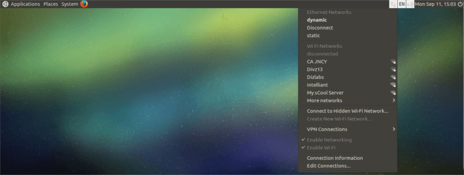
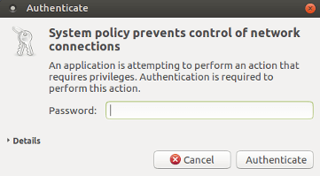
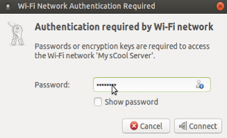

.. _connect-wifi:

How to Connect Wi-Fi
====================

Select your wi-fi/hotspot from the list.

Then you will prompt with the Authenticate window, type password of mssadmin and hit Authenticate -

You will be again asked for the password with the Authenticate window, type password of mssadmin and hit Authenticate -

.. figure:: images/system-authenticate-2.png
   :alt: Connect Wi-fi - System Authentication

And then , You need to type your wi-fi/hotspot password in Wi-Fi Network Authentication Required window -

  

